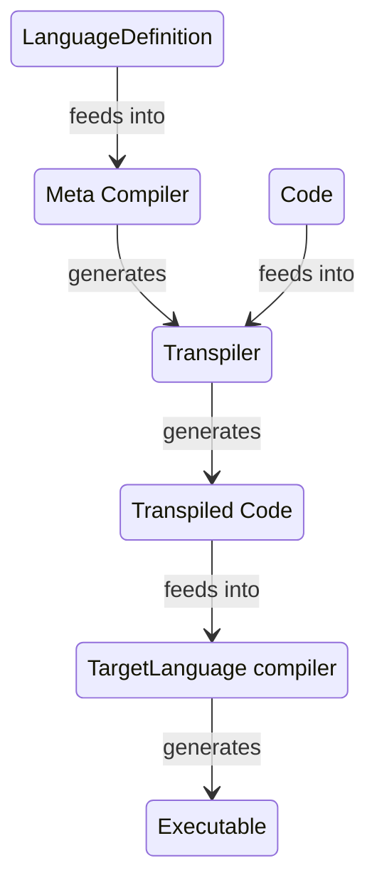
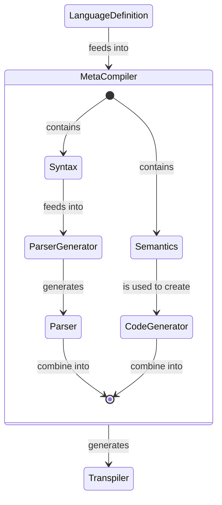
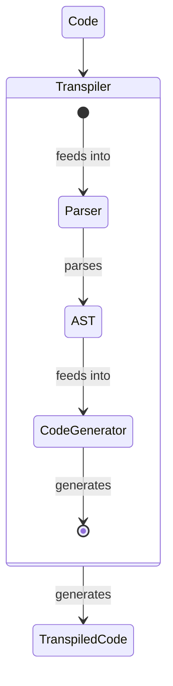

# Meta Compiler:
Provide a system to create transpilers from any user-defined language to a user-chosen 'backend'.

## Architecture:
----
### Bird's eye view:

### MetaCompiler internals:

### Transpiler internals:
