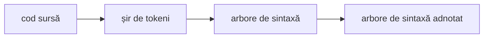
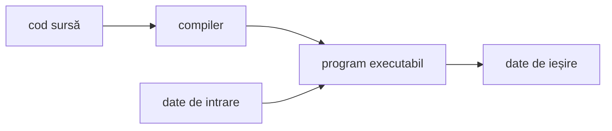
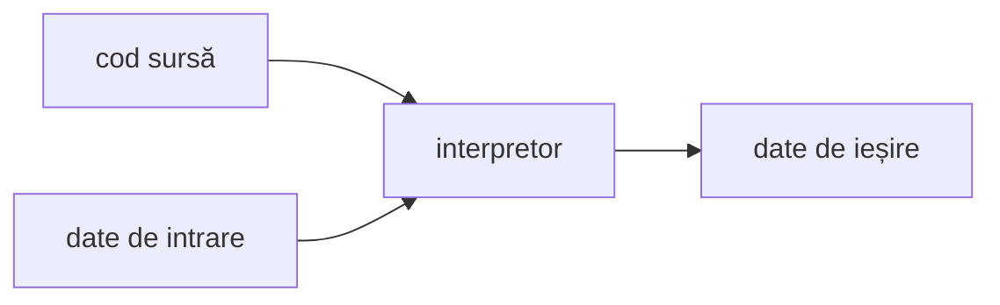
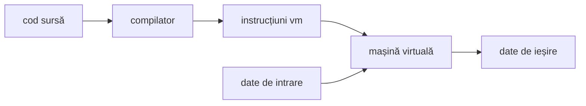
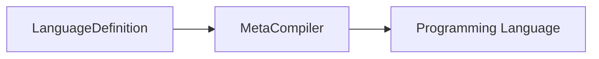
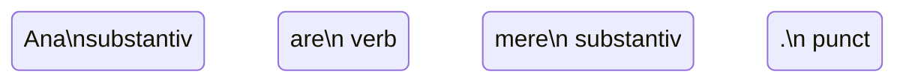
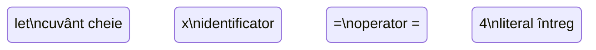
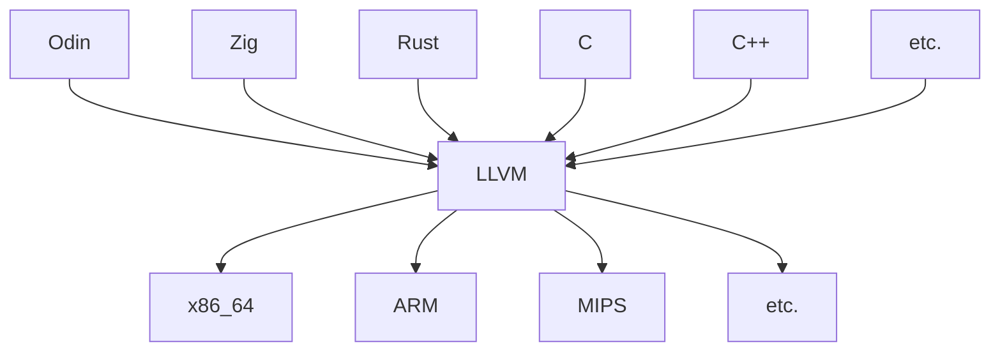
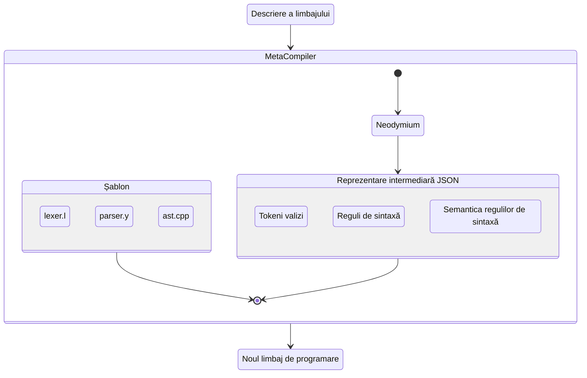

```mermaid
graph TD
    = --> x
    = --> +
    + --> 5
    + --> 2
```












 {
    state "Tokeni valizi" as tokens
    state "Reguli de sintaxă" as syntax
    state "Semantica regulilor de sintaxă" as semantics
    [*] --> tokens : conține
    [*] --> syntax : conține
    [*] --> semantics : conține
}

